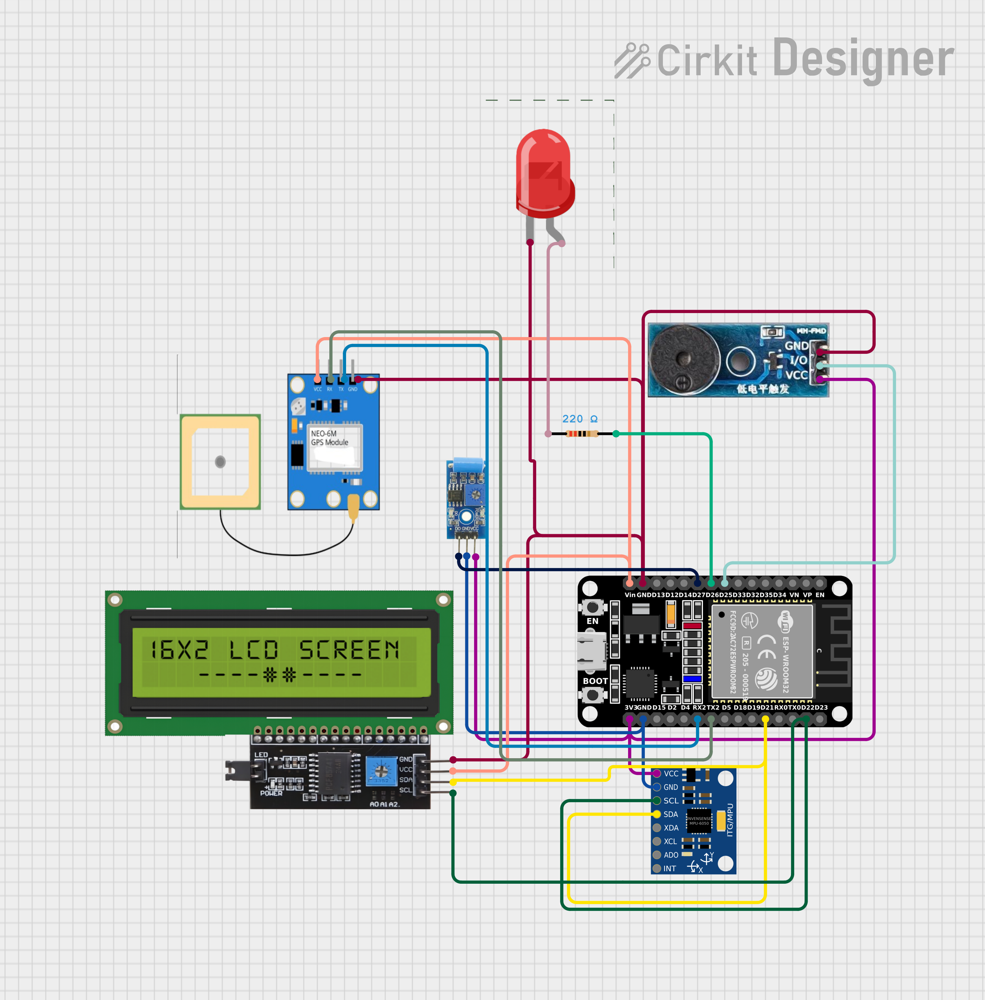

# IoT-Based Accident, Rollover, and Emergency Alert System (Real Hardware)

## Project Overview

This real-hardware project uses ESP32 to detect accidents and rollover events, then sends internet-based real-time alerts with live GPS coordinates.

Core functions:
- Accident detection using MPU6050 accelerometer thresholds
- Rollover detection using tilt and gyroscope logic
- Impact confirmation using SW-420 vibration sensor
- Location tracking using NEO-6M GPS
- Real-time IoT notification to Firebase cloud database
- Location-based emergency alerts with live GPS coordinates
- Local emergency alert using buzzer, LED, and I2C LCD

## Circuit Diagram

View the complete circuit design:
[https://app.cirkitdesigner.com/project/da89038c-82d5-4951-bb28-923adbf1acf6](https://app.cirkitdesigner.com/project/da89038c-82d5-4951-bb28-923adbf1acf6)



## Real Hardware Components

- ESP32 DevKit V1
- MPU6050 (6-axis IMU)
- SW-420 vibration sensor module
- NEO-6M GPS module
- 16x2 I2C LCD
- Active buzzer
- LED + 220 ohm resistor
- Jumper wires and power source

## Real Hardware Pin Connections

### MPU6050 to ESP32 (I2C)

| MPU6050 Pin | ESP32 Pin |
| --- | --- |
| VCC | 3.3V |
| GND | GND |
| SDA | GPIO 21 |
| SCL | GPIO 22 |

### I2C LCD to ESP32 (Shared I2C Bus)

| LCD Pin | ESP32 Pin |
| --- | --- |
| VCC | 5V |
| GND | GND |
| SDA | GPIO 21 |
| SCL | GPIO 22 |

### SW-420 Vibration Sensor to ESP32

| SW-420 Pin | ESP32 Pin |
| --- | --- |
| VCC | 3.3V |
| GND | GND |
| DO | GPIO 34 |

### NEO-6M GPS to ESP32 (UART2)

| NEO-6M Pin | ESP32 Pin |
| --- | --- |
| VCC | 3.3V |
| GND | GND |
| TX | GPIO 16 (RX2) |
| RX | GPIO 17 (TX2) |

### Alert Outputs

| Device | ESP32 Pin |
| --- | --- |
| Buzzer Signal | GPIO 27 |
| LED Anode | GPIO 26 (through 220 ohm resistor) |
| LED Cathode | GND |

## Detection Logic (Real)

### Accident Severity (Accelerometer)

- Minor: |AX| > 10 or |AY| > 10
- Moderate: |AX| > 15 or |AY| > 15
- Severe: |AX| > 20 or |AY| > 20 or |AZ| > 25

### Rollover Detection

Computed values:
- tiltDeg = atan2(sqrt(ax^2 + ay^2), az) * 57.2958
- gyroXY = max(|gx|, |gy|)

Rollover candidate:
- (tiltDeg > 75 and gyroXY > 1.2) OR (gyroXY > 3.5 and tiltDeg > 45)

Rollover confirmation:
- Candidate must be true for 3 consecutive cycles

### Vibration Confirmation

SW-420 digital pulse is used as additional impact confirmation to reduce false positives and improve reliability on real roads.

## Real-Time IoT Notification (Firebase Cloud)

On confirmed accident or rollover, ESP32 sends real-time event data to Firebase Realtime Database over Wi-Fi.

Event payload fields sent to Firebase:
- eventType (accident or rollover)
- severity (minor, moderate, severe)
- latitude (from NEO-6M GPS)
- longitude (from NEO-6M GPS)
- ax, ay, az (accelerometer values)
- gx, gy, gz (gyroscope values)
- vibrationState (SW-420 sensor)
- timestamp (ISO 8601)
- deviceId (unique vehicle identifier)

Example JSON payload:

```json
{
  "eventType": "rollover",
  "severity": "severe",
  "latitude": 28.6139,
  "longitude": 77.2090,
  "ax": 1.2,
  "ay": 9.5,
  "az": 1.3,
  "gx": 3.9,
  "gy": 2.4,
  "gz": 1.1,
  "vibrationState": 1,
  "timestamp": "2026-03-22T12:30:00Z",
  "deviceId": "ESP32-VEH-01"
}
```

## Alert Workflow

1. ESP32 reads MPU6050, SW-420, and NEO-6M continuously.
2. Detection logic confirms accident or rollover.
3. Buzzer and LED are activated.
4. LCD shows emergency status and live parameters.
5. GPS coordinates are attached to event.
6. Event is pushed to cloud endpoint in real time.
7. Dashboard/mobile app can show emergency location immediately.

## Simulation README

Wokwi-only documentation is maintained separately at:
- [wokwisimulation/README.md](wokwisimulation/README.md)
